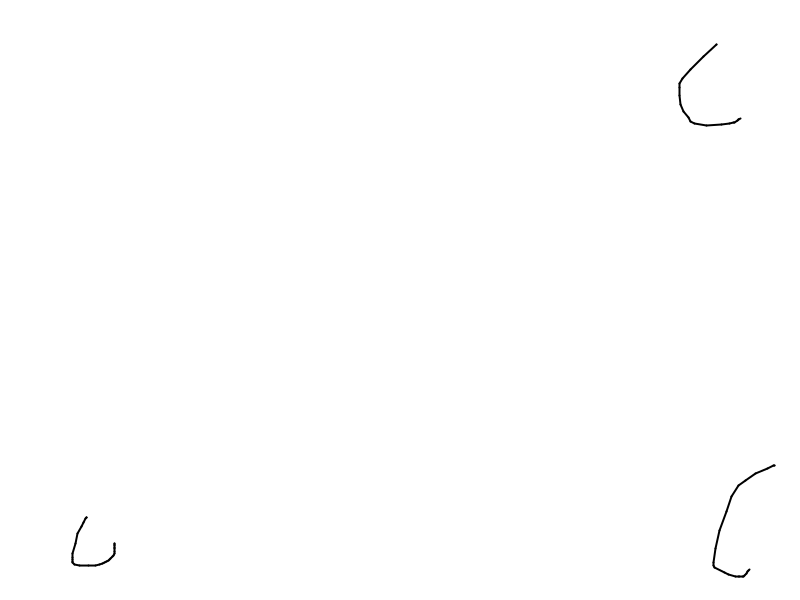
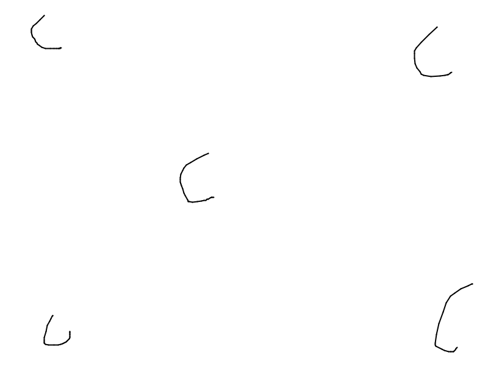
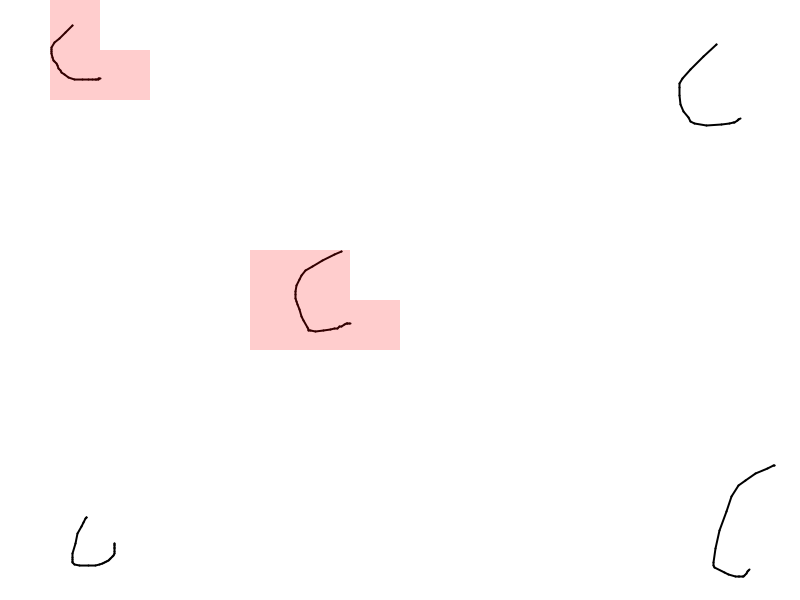

# PDFDiff
Script get diff of images and mark this diff with rectangle

```
  fs.writeFileSync('samples/diff1.png', PNGDiff.getBoundedDiffImage(
    fs.readFileSync('samples/1.png'), 
    fs.readFileSync('samples/2.png'),
    50,
    50
  ));
```

## Samples

### Sample drawing




### Webshoot


## Dependencies
 - pngjs-draw
 - pngjs 
 - pixelmatch
